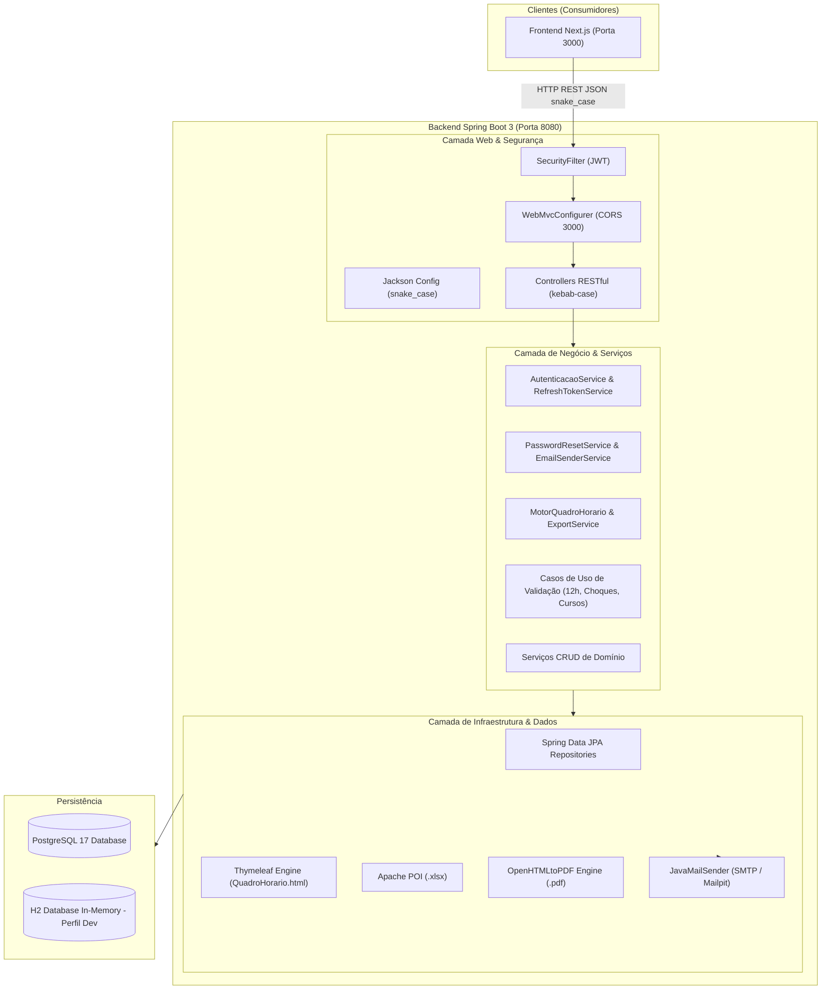
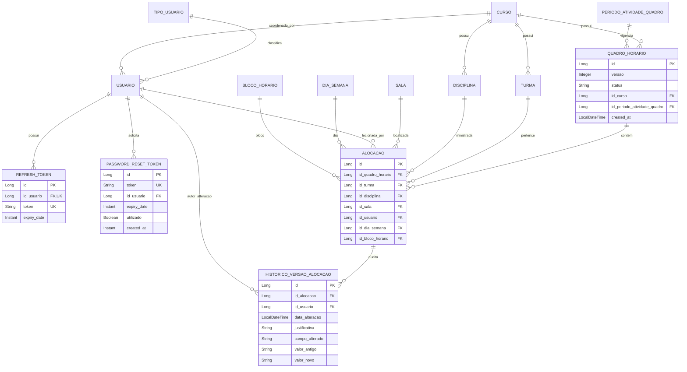

# ESCOPO.md — Fonte da Verdade Consolidada (GINI Backend)

> **Documento Mestre de Governança, Arquitetura e Regras de Negócio**  
> **Status:** Consolidado e Aprovado  
> **Versão:** 2.0.0  
> **Data:** 24/09/2026  
> **Autores:** Arquiteto de Software & Tech Lead  

---

## 1. Visão Geral Atualizada

O **GINI (Grade Integrada de Navegação Institucional)** é uma plataforma voltada à automação, centralização, validação de regras pedagógicas e trabalhistas, e exportação de quadros de horários acadêmicos da **Fatec Itu ("Dom Amaury Castanho")**.

O sistema elimina o uso de planilhas isoladas, prevenindo choques de horários de docentes, salas e turmas, e garantindo conformidade com a legislação trabalhista (descanso interjornada de 12 horas).

### Objetivo Desta Fase de Reconciliação e Correções
1. **Concluir o Motor de Quadro Horário (`MotorQuadroHorario`):** Expor os endpoints consolidados para consulta da grade completa do curso e horários por turma, integrando autorização por curso em produção e desacoplamento no perfil `dev`.
2. **Implementar Exportação Dual:** Disponibilizar a exportação do quadro completo do curso em formato binário **PDF** (via conversão de template Thymeleaf/HTML existente) e formato **Planilha** (Excel `.xlsx` via Apache POI).
3. **Corrigir Autenticação e Sessões Consecutivas:** Implementar a rotação limpa de `RefreshToken`, permitindo logins sucessivos sem exigência de logout prévio e sem violação de unicidade no banco.
4. **Implementar Recuperação de Senha por E-mail:** Criar fluxo completo de solicitação de redefinição de senha com token de uso único (expiração de 15 minutos configurável) e envio de e-mail integrado.
5. **Padronizar Contratos de API:** Unificar rotas no padrão RESTful `kebab-case` plural, parâmetros de consulta e propriedades JSON em `snake_case`, e requests com chaves estrangeiras utilizando obrigatoriamente `LongDTO` (`{"entidade": {"id": 1}}`).
6. **Estabilizar Ambientes e Segurança:** Eliminar bloqueios de `Forbidden (403)` no perfil `dev`, alinhar CORS para o cliente Next.js (`http://localhost:3000`), e sanear o `Dockerfile` e `docker-compose.yml` (PostgreSQL 17 + Mailpit).

---

## 2. Requisitos Mantidos vs. Descartados

| Requisito / Recurso | Classificação | Justificativa / Decisão Consolidada |
| :--- | :---: | :--- |
| **RF01 a RF04 — CRUDs Estruturais (Cursos, Turmas, Disciplinas, Salas, Recursos, Docentes)** | **Mantido** | Entidades e serviços operacionais; sofrem apenas padronização de nomenclatura de rotas, serialização `snake_case` e FKs com `LongDTO`. |
| **RF05 — Prevenção de Conflitos (Docente, Sala, Turma no mesmo bloco/dia)** | **Mantido** | Regra central implementada via casos de uso de validação (`ValidarConflitoSalaUseCase`, `ValidarConflitoTurmaUseCase`, etc.). |
| **RF06 — Sugestão Automática de Ajustes** | **Mantido** | Funcionalidade existente de busca de alternativas viáveis mantida intacta. |
| **RF07 — Intervalo Interjornada de 12 Horas** | **Mantido** | Validado pelo `ValidarCargaHorariaDocenteUseCase` na criação e atualização de alocações. |
| **RF08 — Cópia de Quadro Horário** | **Mantido** | `CopiarQuadroHorarioUseCase` mantido, reutilizando alocações ativas para novos semestres. |
| **RF09 — Auditoria e Histórico de Alterações** | **Mantido & Renomeado** | Renomeado de *Histórico de Alocação* para **Histórico de Versão da Alocação** (`HistoricoVersaoAlocacao`). |
| **RF10 — Motor de Quadro Horário (Consulta Matriz e Turma)** | **Mantido & Expandido** | Exposição formal sob `/motor-quadro/cursos/{curso_id}` e `/motor-quadro/cursos/{curso_id}/turmas/{turma_id}`. |
| **RF11 — Exportação de Quadro (PDF e Planilha)** | **Novo (Aprovado)** | Exportação do quadro de horários do curso em `.pdf` e `.xlsx`. |
| **RF12 — Recuperação de Senha via E-mail** | **Novo (Aprovado)** | Endpoints de solicitação e redefinição com token temporário e serviço SMTP. |
| **Autenticação com Bloqueio de Login Repetido** | **Descartado / Corrigido** | Substituído por estratégia de rotação e sobrescrita da sessão no login. |
| **IDs Planos em Requests (`turmaId: 1`)** | **Descartado / Revertido** | Revertido para o padrão canônico do projeto com `LongDTO` (`turma: { "id": 1 }`). |
| **Uso de snake_case em rotas (`/periodo_atividade_quadro`)** | **Descartado** | Unificado estritamente em `kebab-case` (`/periodos-atividade-quadro`). |
| **Uso de camelCase em JSON e Query Params** | **Descartado** | Migrado globalmente para `snake_case` no backend e frontend. |

---

## 3. Regras de Negócio Consolidadas

### 3.1 Nomenclatura Oficial do Domínio
* **Grade Horária $\rightarrow$ Quadro Horário** (`QuadroHorario` / `/quadros-horarios`)
* **Período Letivo $\rightarrow$ Período de Atividade do Quadro** (`PeriodoAtividadeQuadro` / `/periodos-atividade-quadro`)
* **Histórico de Alocação $\rightarrow$ Histórico de Versão da Alocação** (`HistoricoVersaoAlocacao` / `/historicos-versoes-alocacoes`)
* **Horário $\rightarrow$ Bloco de Horário** (`BlocoHorario` / `/bloco-horarios`)
* **Motor-Grade $\rightarrow$ Motor-Quadro** (`MotorQuadroHorario` / `/motor-quadro`)

### 3.2 Regras do Motor de Quadro Horário
1. **Seleção Unívoca do Quadro Ativo:** Para um dado `curso_id`, o motor deve selecionar exatamente o `QuadroHorario` com `status = 'ATIVO'`. Caso nenhum exista, retorna `404 Not Found`. Caso haja mais de um ativo, retorna `409 Conflict` (ou `422 Unprocessable Entity`).
2. **Matriz Completa do Curso:** Deve cruzar todos os blocos de horário cadastrados (ordenados por `hora_inicio`) com todos os dias da semana ativos. Para turmas sem aula alocada em determinado bloco/dia, o sistema deve preencher a célula explicitamente com valores nulos (`celula_vazia`), preservando a geometria da tabela.
3. **Consulta por Turma Específica:** O endpoint `/motor-quadro/cursos/{curso_id}/turmas/{turma_id}` deve validar que a turma pertence ao curso informado. Se a turma pertencer a outro curso, o backend responde com `404 Not Found`.
4. **Exportação Restrita ao Curso Completo:** As rotas de exportação geram exclusivamente o arquivo do curso consolidado em formato `.pdf` ou `.xlsx`.

### 3.3 Regras de Autenticação e Sessão
1. **Rotação de Refresh Token:** Ao realizar `POST /auth/login`, qualquer `RefreshToken` pré-existente vinculado ao usuário no banco deve ser invalidado/atualizado de forma atômica e transacional, evitando violações de unicidade de chave primária/estrangeira.
2. **Revogação no Logout:** `POST /auth/logout` invalida imediatamente o `RefreshToken` enviado, impedindo novas renovações via `POST /auth/refresh`.
3. **Recuperação de Senha:**
   * Token gerado via `UUID.randomUUID().toString()`, persistido com hash ou valor único e data de expiração.
   * Expiração configurável via variável `APP_SECURITY_PASSWORD_RESET_EXPIRATION_MINUTES` (padrão de 15 minutos).
   * Uso único: após redefinição da senha, o token é marcado como utilizado ou deletado.
   * Notificação via e-mail contendo URL montada a partir de `${FRONTEND_URL}/redefinir-senha?token={token}`.

### 3.4 Regras de Perfis e Segurança
1. **Perfil `dev`:**
   * Nenhum endpoint deve responder `403 Forbidden` por ausência de credenciais ou por falta de vínculo com curso.
   * `ValidarAutorizacaoCursoUseCase` deve desativar a checagem quando `app.security.authorization.enabled = false`.
   * Operações de escrita não autenticadas no perfil `dev` atribuem a auditoria ao usuário administrador padrão (`id = 1`).
2. **Perfil `prod`:**
   * Regras estritamente aplicadas com base na `TabelaAcesso.md`.
   * Coordenadores só podem gerenciar e visualizar recursos do seu próprio curso autorizado (`usuario.curso.id`).
   * Administradores possuem privilégios totais.
   * CORS restrito aos domínios autorizados (incluindo `http://localhost:3000` para o frontend Next.js).

---

## 4. Arquitetura de Backend (As-Is vs. To-Be)

### O que permanece (As-Is Mantido):
* Estrutura de pacotes: `com.fatec.gini` (`web`, `domain`, `infrastructure`, `dto`).
* Modelo relacional central mapeado via JPA e migrações Flyway.
* Camada de validações com casos de uso segregados em leitura e escrita.
* Utilização do Spring Validation com mensagens padronizadas.

### O que será refatorado e criado (To-Be):
1. **Configuração Global do Jackson:** `spring.jackson.property-naming-strategy = SNAKE_CASE` ativado para padronizar todos os DTOs e endpoints de query.
2. **Controllers do Motor:** Criação do `MotorQuadroController` mapeado em `/motor-quadro` com os métodos de consulta (`cursos/{curso_id}`, `cursos/{curso_id}/turmas/{turma_id}`) e exportação (`/exportar/pdf`, `/exportar/planilha`).
3. **Serviços de Exportação:**
   * `QuadroPdfExportService`: integração com Thymeleaf e OpenHTMLtoPDF para renderizar `QuadroHorario.html` em stream de bytes `.pdf`.
   * `QuadroPlanilhaExportService`: construção de workbook Excel `.xlsx` via Apache POI com formatação das grades por turma.
4. **Serviço de E-mail e Recuperação:**
   * Dependência `spring-boot-starter-mail` adicionada ao `pom.xml`.
   * Entidade e repositório `PasswordResetToken`.
   * Endpoints `/auth/solicitar-recuperacao` e `/auth/redefinir-senha`.
5. **Ajuste dos DTOs de Request:** Migração dos campos em `AlocacaoRequest`, `DisciplinaRequest`, `RecursoSalaRequest`, etc., para utilizarem `LongDTO` nas chaves estrangeiras.
6. **Harmonização de Segurança:** Ajuste em `ConfiguracaoSegurancaDev` e `SecurityFilter` para prevenir `AccessDeniedException` quando sem token no modo dev, e ajuste de CORS em `ConfiguracaoSeguranca` para `http://localhost:3000`.

---

## 5. Modelo de Dados (To-Be)

---

## 6. Dívidas Técnicas Identificadas e Plano de Mitigação

| ID | Dívida Técnica | Causa Raiz | Impacto | Ação de Mitigação |
| :---: | :--- | :--- | :--- | :--- |
| **DT-01** | Erro ao logar consecutivamente sem logout | JPA `delete` seguido de `save` sem flush no `RefreshTokenService` colide com constraint única. | Quebra de experiência do usuário e testes automatizados. | Implementar rotação de token in-place ou remoção com `flush()` imediato no repositório. |
| **DT-02** | Bloqueio 403 Forbidden no Perfil `dev` | `SecurityFilter` ativo globalmente + `ValidarAutorizacaoCursoUseCase` disparando exceção sem token. | Desenvolvedor impedido de testar APIs sem autenticação. | Desativar checagens de autorização em `dev` e injetar usuário padrão nos casos de uso. |
| **DT-03** | Inconsistência de Nomenclatura nas Rotas | Rotas criadas com convenções misturadas (`snake_case`, `singular`, `plural`). | Dificuldade de integração e inconsistência na documentação Swagger/OpenAPI. | Padronizar rotas para `kebab-case` plural conforme convenção RESTful. |
| **DT-04** | Divergência de Payload (`camelCase` vs `snake_case`) | Configuração padrão do Spring Boot usa camelCase; frontend espera/envia snake_case. | Falha de mapeamento de propriedades e quebra de contratos. | Configurar Jackson globalmente para `PropertyNamingStrategies.SNAKE_CASE`. |
| **DT-05** | Divergência na representação de FKs (`Long` vs `LongDTO`) | Refatoração parcial anterior removeu `LongDTO` apenas em `AlocacaoRequest` e `DisciplinaRequest`. | Falta de consistência nos payloads de cadastro/atualização. | Unificar todas as FKs de requests para o tipo canônico `LongDTO`. |
| **DT-06** | Falha de inicialização no Docker Compose | `.env.exemple` não define variáveis requeridas pelo PostgreSQL 17 (`POSTGRES_DB`, etc.) e backend sobe sem perfil prod. | Container do backend falha ao iniciar ou roda com banco em memória. | Atualizar `.env.exemple`, ajustar `docker-compose.yml` e otimizar `Dockerfile`. |

---

## 7. Documentos Complementares de Governança e Auditoria

1. **Matriz de Reconciliação de Divergências:** [`docs/DIVERGENCIAS.md`](file:///c:/Users/felip/Desktop/PI/backend-java/docs/DIVERGENCIAS.md) — Compara detalhadamente documentações legadas, código e relatos da equipe em 13 eixos temáticos, definindo as decisões de resolução.
2. **Auditoria da Lógica Executada e Inventário de Código Intocável:** [`docs/STATUS_LOGICA_EXISTENTE.md`](file:///c:/Users/felip/Desktop/PI/backend-java/docs/STATUS_LOGICA_EXISTENTE.md) — Documenta a execução da suíte de testes (34 de 35 aprovados) e cataloga o inventário definitivo de classes, validadores e entidades que estão **CONGELADOS (INTOCÁVEIS)** sob o Scope Guard.
3. **Catálogo Exaustivo de Contratos:** [`FRONTEND_INTEGRATION.md`](file:///c:/Users/felip/Desktop/PI/backend-java/FRONTEND_INTEGRATION.md) — Especificação completa de 100% dos endpoints, requests, responses em `snake_case` e padrão `LongDTO`.
4. **Contrato Operacional e Scope Guard:** [`AGENTS.md`](file:///c:/Users/felip/Desktop/PI/backend-java/AGENTS.md) — Regras de preservação de código, princípios operacionais e checklist obrigatório para agentes IA e desenvolvedores.
5. **Backlog Executável:** [`TASKS.md`](file:///c:/Users/felip/Desktop/PI/backend-java/TASKS.md) — Lista de tarefas acionáveis com tags `ASSIGNEE: AI | HUMAN`, dependências, caminhos permitidos e proibidos.

