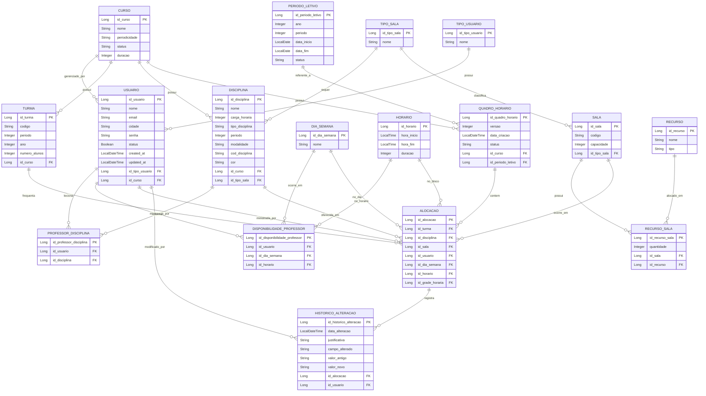

# Análise de Definições Consolidadas - Projeto GINI

Este documento resume exclusivamente as informações, regras de negócio, tecnologias e arquiteturas que já estão consolidadas e definidas como "certas" na documentação técnica do Projeto Integrador: **Grade Integrada de Navegação Institucional (GINI)**.

## 1. Informações Gerais do Projeto
*   **Nome do Sistema:** GINI (Grade Integrada de Navegação Institucional).
*   **Instituição Alvo:** Fatec Itu ("Dom Amaury Castanho").
*   **Público-Alvo (Atores):** Coordenadores e Administradores Acadêmicos.
*   **Objetivo Principal:** Centralizar e automatizar a criação, manutenção e validação dos quadros de horários acadêmicos, eliminando processos manuais, planilhas isoladas e retrabalhos.

## 2. Stack Tecnológico Decidido
*   **Back-end:** Java 21 com Spring Boot 3.5.14.
*   **Ecossistema Spring:** Spring Web, Spring Data JPA, Spring Validation e SpringDoc OpenAPI (Swagger para documentação de rotas).
*   **Front-end:** Next.js com TypeScript.
*   **Banco de Dados:** PostgreSQL (Relacional).
*   **Nuvem/Infraestrutura:** AWS (Amazon Web Services).
*   **Ferramentas de Apoio:** Figma (Prototipagem), GitHub Projects/Kanban (Gestão de Tarefas), Mermaid e PlantUML (Modelagem).

## 3. Arquitetura e Padrões de Projeto
O sistema adota uma **Arquitetura em Camadas (Layered Architecture)** estruturada da seguinte forma no Back-end (comunicação via API REST):
*   **Controllers (`web`):** Recebem as requisições HTTP e disponibilizam os recursos.
*   **Services / Use Cases (`domain.services`):** Isolam regras de negócios (cálculo de 12h, checagem de conflitos). Divididos em casos de uso de leitura e escrita.
*   **Repositories (`infrastructure.repositories`):** Acesso a dados utilizando Spring Data JPA.
*   **Entities (`domain`):** Representação dos objetos de domínio.
*   **DTOs (`dto`):** Objetos de transferência de dados para entrada/saída da API.
*   **Mappers (`infrastructure.mappers`):** Responsáveis pela conversão bidirecional entre DTOs e Entities.
*   **Exceptions (`web.exception`):** Estrutura própria e padronizada para tratamento de erros e respostas da API.

## 4. Regras de Negócio e Funcionalidades Fechadas (Requisitos Funcionais)
As seguintes regras já foram definidas como escopo obrigatório e certo para o sistema:
1.  **Prevenção de Conflitos (RF05):** O sistema é estritamente proibido de permitir alocações simultâneas para o mesmo professor, sala ou turma.
2.  **Regra de Descanso Interjornada (RF07):** É obrigatória a validação de um intervalo mínimo de 12 horas de descanso entre o fim da jornada de um professor e o início da próxima.
3.  **Sugestão de Ajustes (RF06):** O sistema deve ser capaz de identificar divergências e mostrar automaticamente horários incompatíveis.
4.  **Histórico e Auditoria (RF09):** Toda e qualquer alteração no quadro de horários gera um histórico rastreável contendo data, usuário, justificativa, valor antigo e novo valor.
5.  **Reaproveitamento de Grade (RF10):** Capacidade consolidada de copiar grades de semestres anteriores (trazendo apenas registros que seguem ativos).

## 5. Estrutura de Banco de Dados Definida
O Dicionário de Dados estabeleceu as seguintes tabelas (Entidades) e seus relacionamentos diretos:
*   **Acesso:** `TIPO_USUARIO`, `USUARIO`.
*   **Estrutura Acadêmica:** `CURSO`, `TURMA`, `DISCIPLINA`.
*   **Docentes:** `PROFESSOR_DISCIPLINA` (tabela associativa validando o que o professor pode lecionar), `DISPONIBILIDADE_PROFESSOR` (vinculada a dias e horários).
*   **Tempo:** `DIA_SEMANA`, `BLOCO_HORARIO`, `PERIODO_LETIVO`.
*   **Espaço Físico:** `TIPO_SALA`, `SALA`, `RECURSO`, `RECURSO_SALA`.
*   **Core do Sistema:** `QUADRO_HORARIO` (Container do semestre) e `ALOCACAO` (Onde aula, professor, sala, dia e horário se conectam).
*   **Auditoria:** `HISTORICO_ALTERACAO`.

## 6. Metodologia de Trabalho da Equipe
*   Divisão rígida em subequipes: Back-end, Front-end, Infraestrutura e Banco de Dados, Documentação, Testes.
*   Organização de demandas centralizada no GitHub através de *Issues* alocadas em colunas de um quadro Kanban ("A Fazer", "Em Andamento", "Concluído").

